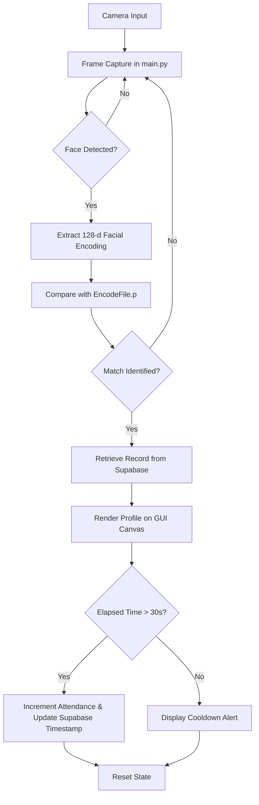

# Face Recognition Attendance System

[](https://www.python.org/)
[](https://opencv.org/)
[](https://supabase.com/)
[](https://mediapipe.dev/)
[](LICENSE)

An automated real-time face recognition attendance management system built with Python, OpenCV, `face_recognition` (dlib), MediaPipe, and Supabase. The system detects and recognizes faces via a live camera feed, compares 128-dimensional encodings against pre-computed local data, displays student information on a graphical user interface, and updates cloud records with a 30-second cooldown mechanism to prevent duplicate entries.

---

## Features

- **Real-Time Detection and Recognition**: High-accuracy face detection and 128-dimensional encoding extraction powered by `dlib` and `face_recognition`.
- **Database Integration**: Cloud storage and database synchronization using Supabase for student metadata and profile assets.
- **Cooldown Verification**: Automated timestamp validation ensuring student attendance cannot be logged multiple times within a 30-second window.
- **Graphical User Interface**: Real-time canvas overlay rendering system states, student details, and status indicators onto a custom background layout.
- **3D Landmark Triangulation**: Standalone MediaPipe module for real-time 468-point 3D face mesh visualization.

---

## Directory Architecture

```text
Face_recog/
├── main.py
├── Encodegenrator.py
├── AddDataToDatabase.py
├── face_mesh.py
├── EncodeFile.p
├── .env
├── Resources/
│   ├── Background.png
│   └── Modes/
└── two_people.mp4
```

### File Explanations

| File / Directory | Description |
| :--- | :--- |
| **`main.py`** | Primary application entry point. Captures webcam frames, performs facial detection and recognition, queries student records from Supabase, updates GUI elements, and manages attendance update cooldown logic. |
| **`Encodegenrator.py`** | Pre-processing utility that loads student images, generates 128-dimensional facial feature vectors using `face_recognition`, couples encodings with student IDs, and serializes output to `EncodeFile.p`. |
| **`AddDataToDatabase.py`** | Database initialization script that inserts or updates student records (ID, Name, Major, Year, Attendance count, Academic Standing, Last Attendance) into the Supabase `students` table. |
| **`face_mesh.py`** | Standalone computer vision script demonstrating 468 3D facial landmark detection and mesh rendering using MediaPipe FaceMesh over video feeds. |
| **`EncodeFile.p`** | Serialized binary file containing pre-computed facial encodings and corresponding student ID mappings for fast runtime matching. |
| **`.env`** | Environment configuration file containing secret API credentials (`SUPABASE_URL` and `SUPABASE_KEY`). |
| **`Resources/`** | Graphical user interface assets including background templates (`Background.png`) and status mode overlays (`Modes/`). |
| **`two_people.mp4`** | Sample video file used for demonstrating facial landmark tracking in `face_mesh.py`. |

---

## Prerequisites

- **Python 3.8 or higher**
- **Connected camera or webcam**
- **Supabase account and project**
- **C++ Build Tools & CMake** (required for `dlib` / `face_recognition` compilation)

---

## Installation and Setup

### 1. Clone the Repository
```bash
git clone https://github.com/your-username/Face_recog.git
cd Face_recog
```

### 2. Install Dependencies
```bash
pip install opencv-python face-recognition cvzone numpy supabase python-dotenv mediapipe
```

### 3. Environment Configuration
Create a `.env` file in the project root directory with the following variables:
```env
SUPABASE_URL=your_supabase_project_url
SUPABASE_KEY=your_supabase_api_key
```

### 4. Database and Storage Setup

#### Table Schema: `students`
| Column Name | Data Type | Key Type | Description |
| :--- | :--- | :--- | :--- |
| `id` | `INTEGER` | Primary Key | Unique Student Identifier |
| `name` | `TEXT` | - | Student Full Name |
| `major` | `TEXT` | - | Academic Major / Field of Study |
| `starting_year` | `INTEGER` | - | Year of Enrollment |
| `total_attendance` | `INTEGER` | - | Cumulative Attendance Count |
| `standing` | `TEXT` | - | Academic Standing Grade |
| `last_attendance` | `TIMESTAMPTZ` / `TEXT` | - | Timestamp of Last Attendance Record |

#### Storage Bucket
Create a public Supabase Storage bucket named `students-files` to store student profile images.

---

## Execution Guide

### Step 1: Populate Database Records
Run the database script to populate the Supabase `students` table:
```bash
python AddDataToDatabase.py
```

### Step 2: Generate Face Encodings
Execute the encoding generator script to produce `EncodeFile.p`:
```bash
python Encodegenrator.py
```

### Step 3: Run Main System
Launch the main application:
```bash
python main.py
```
*Press `q` to terminate the application.*

### Step 4: Run Face Mesh Demo (Optional)
To execute the standalone MediaPipe 3D face mesh demonstration:
```bash
python face_mesh.py
```

---

## System Execution Flow



---

## Tech Stack

- **Programming Language:** Python 3.8+
- **Computer Vision:** OpenCV, cvzone, MediaPipe
- **Facial Recognition:** face_recognition (dlib)
- **Backend / Database:** Supabase (Database & Object Storage)
- **Environment Management:** python-dotenv
- **Data Serialization:** pickle

---

## License

Distributed under the MIT License.

